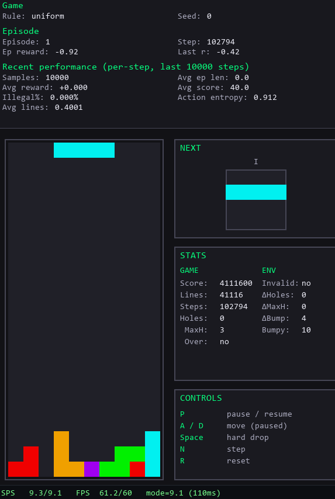

# RL-Tetris



Experimental playground for teaching AI to play Tetris.

The project is a research and learning sandbox focused on planning policies, reinforcement learning, imitation, and representation learning. The codebase is YAML-driven (Hydra + Pydantic) to support fast experimentation.

---

## What is inside

### Learning approaches

This project combines planning, imitation learning, and reinforcement learning for Tetris:

- Heuristic planning policies (Codemy-style linear heuristics with lookahead)
- Genetic Algorithm (GA) optimization of heuristic weights
- Temporal-difference (TD) learning for heuristic weights (GAE-style value updates)
- Imitation learning (behavior cloning from expert data)
- Reinforcement learning (PPO, Maskable PPO)

### Models and representations

Configurable via YAML:

- SB3 policies with custom feature extractors (CNN/ViT/MLP-Mixer)
- Planning policies currently use a linear value scorer
- Roadmap: MLP/CNN value models on post-action states for planning

### Environment

- Custom Rust Tetris engine (PyO3 + maturin)
- Gymnasium-compatible Python envs
- Pygame rendering

---

## Requirements

- Python >= 3.10 with pip
- Rust toolchain (rustc + cargo via rustup) for the PyO3/maturin engine
- Windows: Visual Studio Build Tools with "Desktop development with C++"

Python dependencies are declared in `pyproject.toml` and installed via `pip install -e .`.

---

## Installation

```bash
pip install -e .
```

Optional visualization extras:

```bash
pip install -e .[viz]
```

---

## CLI tools

After installation, the following commands are available:

- `tetris-train` - train a model (RL, imitation, GA)
- `tetris-watch` - watch a trained agent play (pygame)
- `tetris-datagen` - generate expert datasets
- `tetris-engine-speedtest` - Rust engine speed test

All training and evaluation is driven via YAML configs.

Example:

```bash
tetris-train -cfg .\configs\ppo\ppo_vit.yaml
```

TD heuristic training:

```bash
tetris-train -cfg .\configs\td\td_heuristic.yaml
```

Config layout (Hydra):

- `configs/<algo>/*.yaml` are entrypoints (GA/TD/PPO/imitation).
- `conf/` holds building blocks: envs, rewards, planning policies, trains, sb3 policies.

Reproducibility:

- `run.seed` seeds Python/NumPy/Torch once per run; env/episode seeds are derived from it.

---

## Project status and goals

This is not a polished framework. It is a personal playground to:

- explore NN architectures
- compare planning vs imitation vs RL
- iterate fast on envs and configs

## Best results so far (informal)

- Planning: Codemy-style heuristic with plies=3 and 3rd-ply expectimax.
- Distill: behavior cloning from the planner into a reactive policy.
- Models: ViT with column tokens learns faster; CNN reaches similar quality and is faster at inference.
- Outcome: fast, reactive inference with near-planning performance (no search at runtime).
- Demo: the GIF above shows a CNN reactive policy distilled from Codemy plies=3 expectimax; weights will be shared after refinement.

---

## Disclaimer

Expect:

- fast iteration
- sharp edges
- evolving APIs
